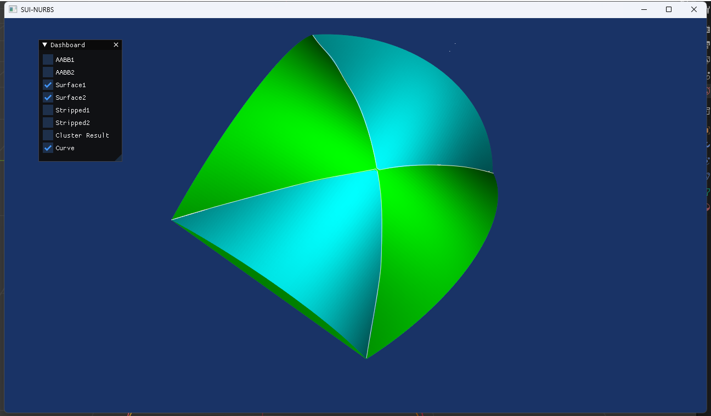
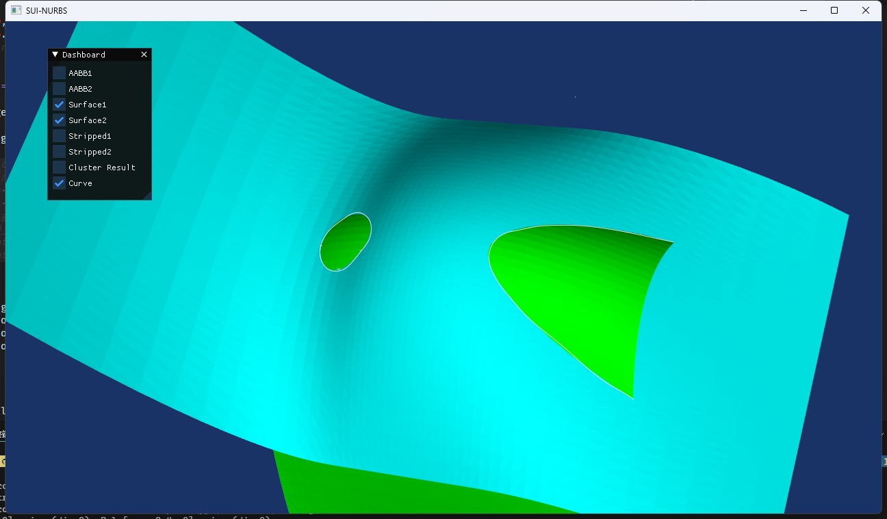

# SUI-NURBS: Speed-Up the Intersection between Two NURBS Surfaces

## Introduction

This repository contains the source code for reimplementing the algorithm in Python for speeding up the intersection between two NURBS surfaces. The original algorithm was proposed by [Lin et al.](https://ieeexplore.ieee.org/abstract/document/6616551/) in 2014.

## Installation

Requires Python 3.6+, VS2019+, Cuda 11.3+ and PyTorch 1.10+

Tested in Anaconda3 with Python 3.10 and PyTorch 2.2.1

### One time setup (Windows)

Install the [Cuda toolkit](https://developer.nvidia.com/cuda-toolkit) (required to build the PyTorch extensions). Pick the appropriate version of PyTorch compatible with the installed Cuda toolkit. Below is an example with Cuda 11.8

```bash
conda create -n sui-nurbs python=3.10
conda activate sui-nurbs
conda install pytorch torchvision torchaudio cudatoolkit=11.8 -c pytorch -c conda-forge
pip install -r requirements.txt
```

## Usage

Currently, we have two demos available for running. You can use the following command to run the demo. And the detail of `args` will be shown below.

```bash
python demo.py [-args args]
python demo_clip.py [-args args]
```

The `demo.py` will output the intersection curves between two NURBS surfaces. And the `demo_clip.py` will output the intersection w/ clipped surfaces. Feel free to modify the trimming curves.

### Arguments

- `-f{i}`/`--filename{i}` (str): The path to the NURBS surface control points in numpy array format. You can generate the file w/ `np.save(filename, array)`, please make sure `array.shape=[a, b, 4]`.
- `-m{i}`/`--u-intervals{i}` (int): The number of AABBs' intervals in the u-direction. Default: `1024`
- `-n{i}`/`--v-intervals{i}` (int): The number of AABBs' intervals in the v-direction. Default: `1024`
- `-p{i}`/`--u-degree{i}` (int): The degree of the NURBS surface in the u-direction. Default: `3`
- `-q{i}`/`--v-degree{i}` (int): The degree of the NURBS surface in the v-direction. Default: `3`
- `-s{i}`/`--scalar{i}` (float): The scalar for the knotvectors in order to avoid the `nan` problem. Default: `25.0`

The `{i}s` refer to the index of the NURBS surface. You can set the index to `0` or `1` to specify the NURBS surface.

### Examples

```bash
python demo.py -f0 cross.npy -f1 cross_rev.npy
```

With the above command, you can get the intersection curves between two NURBS surfaces called `cross.npy` and the result will be shown in a window like the img below.



Also, you can run

```bash
python demo.py -f0 cross.npy -f1 weight.npy
```

to see the intersection curves between `cross.npy` and `weight.npy`.



### Scripts

We have two scripts now. The `perftest.py` will test the performance of the algorithm and output the `cProfile` stats. The `gen_npy.py` will help you to generate the NURBS surface control points in numpy array format.

```bash
python scripts/perftest.py
python scripts/gen_npy.py
```

In `gen_npy.py`, you should edit the `ctrlpts` variable to generate the numpy array.

## Generating NURBS surface control points

We recommend using the `Blender` software to generate the NURBS surface control points. You can use the blender script to output the control points. One possible script is shown below.

```python
import bpy
import numpy as np

# Get the currently selected object in the scene
obj = bpy.context.active_object
V_COUNT = 4

control_points_data = []

# Check if the object is a surface
if obj.type == 'SURFACE':
    # Access the surface data of this object
    curve_data = obj.data
    count = 0
    # Iterate through all the splines
    for spline in curve_data.splines:
        # If it's a NURBS type curve, access its control points
        if spline.type == 'NURBS':
            spline_points = []
            for point in spline.points:
                # Save the coordinates of the control points
                spline_points.append(list(point.co[:]))
                count += 1
                if count == V_COUNT:
                    control_points_data.append(spline_points)
                    count = 0
                    spline_points = []
        
ctrlpts = np.array(control_points_data)
ctrlpts[..., 0:3] *= ctrlpts[..., 3, None]
np.save('filename.npy', ctrlpts)
```

You should manually modify the `V_COUNT` and `filename.npy` to generate the NURBS surface control points. Then move the file into the `data` folder.

## Thanks

Many thanks to the authors of the original paper for providing the algorithm. We reimplemented the algorithm in Python and PyTorch for better performance. We also thank [SUI](https://space.bilibili.com/1954091502) for inspiring us to name the project. 
